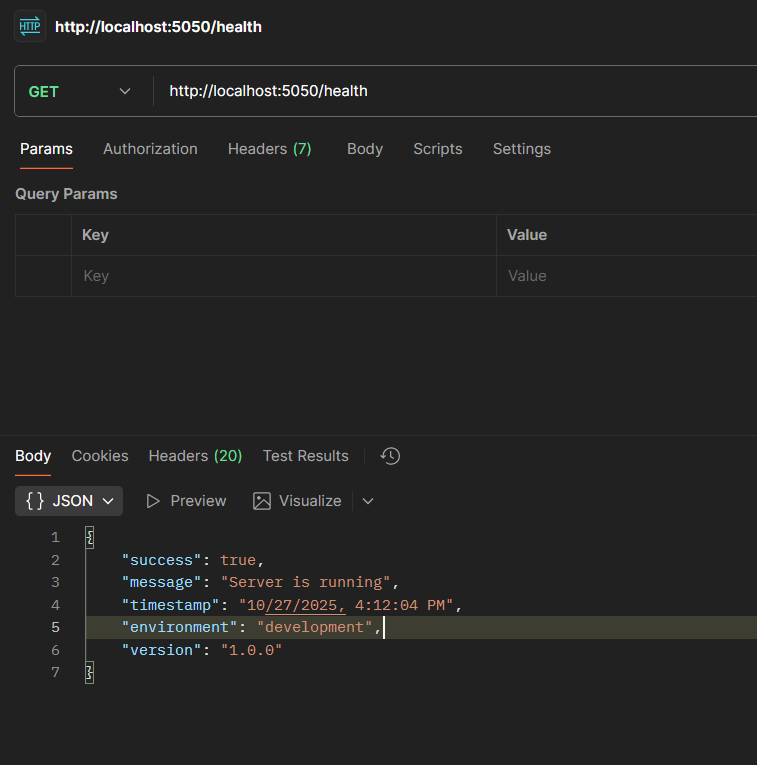
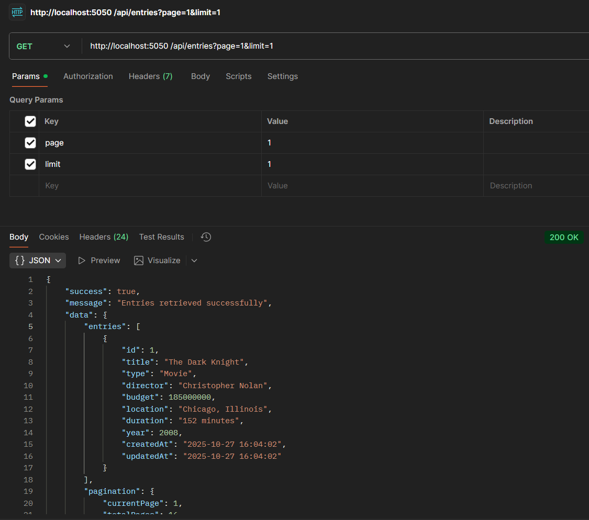
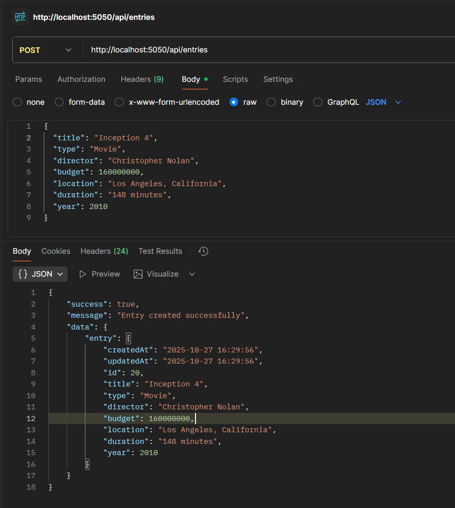
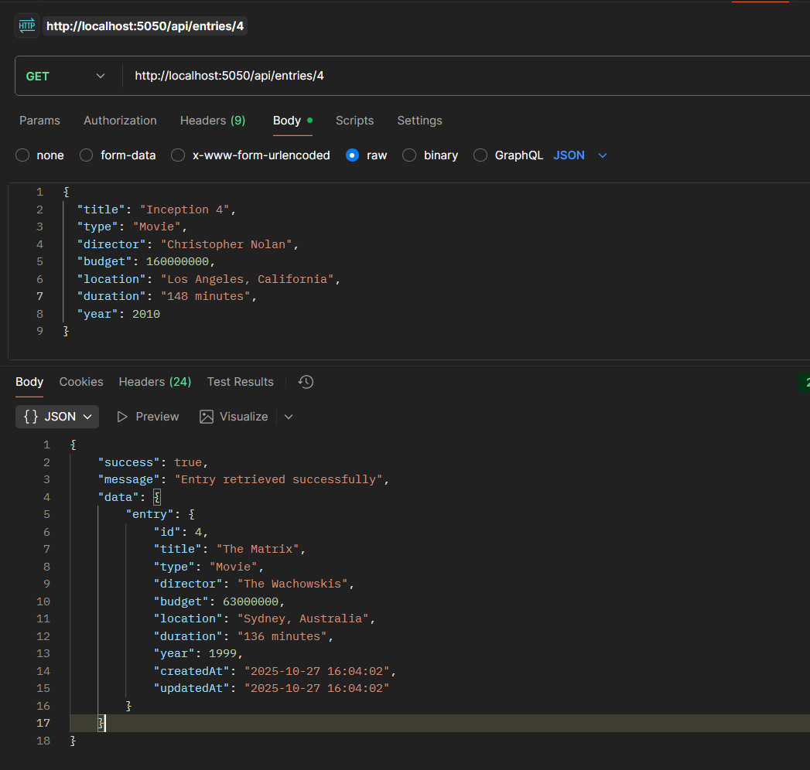
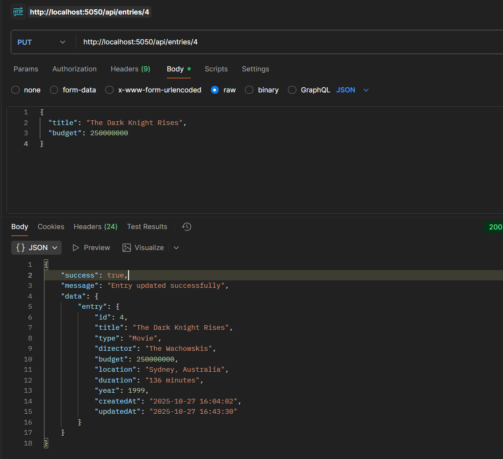
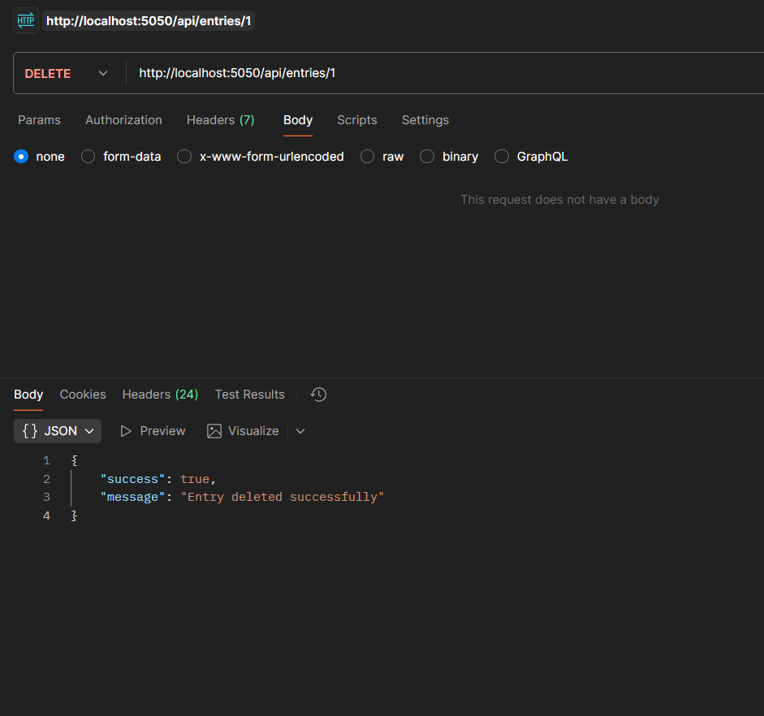
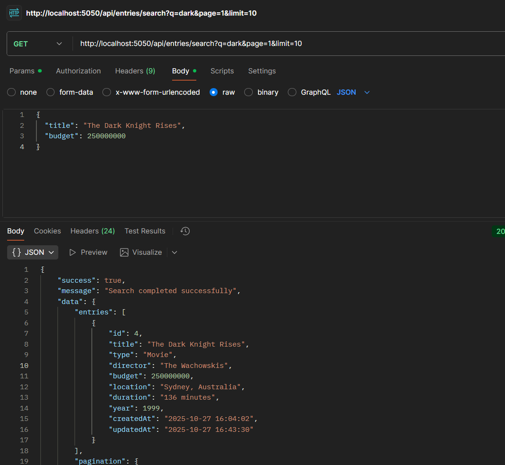
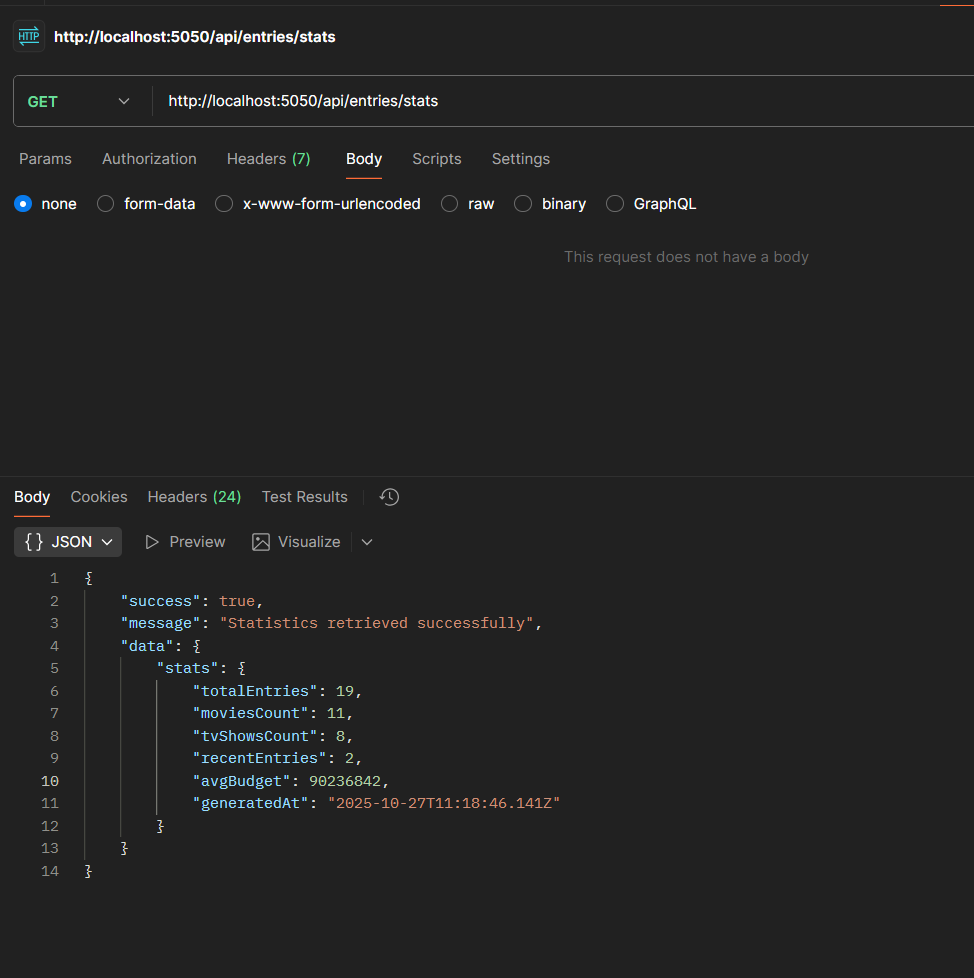

# Favorite Movies & TV Shows API

A RESTful backend service for managing favorite movies and TV shows with full CRUD operations, pagination, and search functionality.

## Features

- Add new movie/TV show entries
- List entries with pagination
- Edit existing entries
- Delete entries
- Search entries by title
- Input validation with Yup
- MySQL database with Sequelize ORM
- Production-ready error handling
- Rate limiting and security middleware
- Automatic database seeding

## Technology Stack

- **Backend Framework**: Node.js with Express
- **Database**: MySQL
- **ORM**: Sequelize
- **Validation**: Yup
- **Security**: Helmet, CORS, Rate Limiting
- **Logging**: Morgan

##  Prerequisites

Before you begin, ensure you have the following installed:

- **Node.js**
- **MySQL**
- **Git**

##  Step-by-Step Setup

### Step 1: Clone the Repository

```bash
git clone <https://github.com/Raj-kumar-singha/Favorite-Movies-TV-Shows.git>
cd Favorite-Movies-TV-Shows
```

### Step 2: Install Dependencies

```bash
npm install
```

### Step 3: Environment Configuration

1. **Edit the `.env` file with your configuration:**

```env
# Server Configuration
PORT= You can give your ip(e.g.: 5050)
NODE_ENV=development

# Database Configuration
DB_HOST=localhost
DB_PORT=3306
DB_NAME=favorite_movies_db
DB_USERNAME=your_mysql_username(e.g.: root)
DB_PASSWORD=your_mysql_password(e.g.: admin12345)

# Security
CORS_ORIGINS=http://localhost:3000,http://localhost:5173
```

### Step 4: Database Setup

1.**Create the database:**

```sql
mysql -u root -p
CREATE DATABASE favorite_movies_db;
exit
```

### Step 5: Start the Application

```bash
# Development mode (with auto-reload)
npm run dev

```

**Expected Output:**

```bash
Starting Favorite Movies & TV Shows API...
Database connected successfully
Database synchronized
Database contains 16 entries - skipping seeding

Server is running!
   URL: http://localhost:3000
   Health: http://localhost:3000/health
   API: http://localhost:3000/api/entries

Ready to manage your favorite movies and TV shows!
```

### Step 6: Verify Installation

Test the health endpoint:

```bash
http://localhost:3000/health
```

**Expected Response:**

```json
{
    "success": true,
    "message": "Server is running",
    "timestamp": "10/27/2025, 4:12:04 PM",
    "environment": "development",
    "version": "1.0.0"
}
```

## op



## API Documentation

### Base URL

```bash
http://localhost:5050 (as your given ip)
```

### Authentication

No authentication required for this API.

### Rate Limiting

- **General requests**: 100 requests per 15 minutes
- **Write requests**: 20 requests per 15 minutes
- **Search requests**: 50 requests per 15 minutes

##  API Endpoints

### 1. Health Check

**GET** `/health`

Check if the server is running.

**Response:**

```json
{
    "success": true,
    "message": "Server is running",
    "timestamp": "10/27/2025, 4:12:04 PM",
    "environment": "development",
    "version": "1.0.0"
}
```

### 2. Get All Entries

**GET** `/api/entries`

Retrieve all entries with pagination.

**Query Parameters:**

- `page` (optional): Page number (default: 1)
- `limit` (optional): Items per page (default: 10, max: 100)

**Example:**

```bash

GET /api/entries?page=1&limit=5
```

**Response:**

```json
{
    "success": true,
    "message": "Entries retrieved successfully",
    "data": {
        "entries": [
            {
                "id": 1,
                "title": "The Dark Knight",
                "type": "Movie",
                "director": "Christopher Nolan",
                "budget": 185000000,
                "location": "Chicago, Illinois",
                "duration": "152 minutes",
                "year": 2008,
                "createdAt": "2025-10-27 16:04:02",
                "updatedAt": "2025-10-27 16:04:02"
            }
        ],
        "pagination": {
            "currentPage": 1,
            "totalPages": 16,
            "totalEntries": 16,
            "hasNextPage": true,
            "hasPrevPage": false,
            "limit": 1
        }
    }
}
```

### OP



### 3. Create New Entry

**POST** `/api/entries`

Add a new movie or TV show entry.

**Request Body:**

```json
{
  "title": "Inception 4",
  "type": "Movie",
  "director": "Christopher Nolan",
  "budget": 160000000,
  "location": "Los Angeles, California",
  "duration": "148 minutes",
  "year": 2010
}
```

**Required Fields:**

- `title`: String (required)
- `type`: String (required) - "Movie" or "TV Show"
- `director`: String (required)
- `budget`: Number (required)
- `location`: String (required)
- `duration`: String (required)
- `year`: Number (required)

**Response:**

```json
{
    "success": true,
    "message": "Entry created successfully",
    "data": {
        "entry": {
            "createdAt": "2025-10-27 16:29:56",
            "updatedAt": "2025-10-27 16:29:56",
            "id": 20,
            "title": "Inception 4",
            "type": "Movie",
            "director": "Christopher Nolan",
            "budget": 160000000,
            "location": "Los Angeles, California",
            "duration": "148 minutes",
            "year": 2010
        }
    }
}
```

### oP



### 4. Get Entry by ID

**GET** `/api/entries/:id`

Retrieve a specific entry by its ID.

**Example:**

```bash
GET /api/entries/4
```

**Response:**

```json
{
    "success": true,
    "message": "Entry retrieved successfully",
    "data": {
        "entry": {
            "id": 4,
            "title": "The Matrix",
            "type": "Movie",
            "director": "The Wachowskis",
            "budget": 63000000,
            "location": "Sydney, Australia",
            "duration": "136 minutes",
            "year": 1999,
            "createdAt": "2025-10-27 16:04:02",
            "updatedAt": "2025-10-27 16:04:02"
        }
    }
}
```

### OP



### 5. Update Entry

**PUT** `/api/entries/:id`

Update an existing entry.

**Request Body (partial update allowed):**

```json
{
  "title": "The Dark Knight Rises",
  "budget": 250000000
}
```

**Response:**

```json
{
    "success": true,
    "message": "Entry updated successfully",
    "data": {
        "entry": {
            "id": 4,
            "title": "The Dark Knight Rises",
            "type": "Movie",
            "director": "The Wachowskis",
            "budget": 250000000,
            "location": "Sydney, Australia",
            "duration": "136 minutes",
            "year": 1999,
            "createdAt": "2025-10-27 16:04:02",
            "updatedAt": "2025-10-27 16:43:30"
        }
    }
}
```

## op



### 6. Delete Entry

**DELETE** `/api/entries/:id`

Delete an entry by its ID.

**Example:**

```bash
DELETE /api/entries/1
```

**Response:**

```json
{
  "success": true,
  "message": "Entry deleted successfully"
}
```

## op



### 7. Search Entries

**GET** `/api/entries/search`

Search entries by title.

**Query Parameters:**

- `q` (required): Search query
- `page` (optional): Page number (default: 1)
- `limit` (optional): Items per page (default: 10, max: 100)

**Example:**

```bash
GET /api/entries/search?q=dark&page=1&limit=10
```

**Response:**

```json
{
    "success": true,
    "message": "Search completed successfully",
    "data": {
        "entries": [
            {
                "id": 4,
                "title": "The Dark Knight Rises",
                "type": "Movie",
                "director": "The Wachowskis",
                "budget": 250000000,
                "location": "Sydney, Australia",
                "duration": "136 minutes",
                "year": 1999,
                "createdAt": "2025-10-27 16:04:02",
                "updatedAt": "2025-10-27 16:43:30"
            }
        ],
        "pagination": {
            "currentPage": 1,
            "totalPages": 1,
            "totalEntries": 1,
            "hasNextPage": false,
            "hasPrevPage": false,
            "limit": 10
        },
        "searchQuery": "dark"
    }
}
```

## op 



### 8. Get Statistics

**GET** `/api/entries/stats`

Get statistics about the entries.

**Response:**

```json
{
    "success": true,
    "message": "Statistics retrieved successfully",
    "data": {
        "stats": {
            "totalEntries": 19,
            "moviesCount": 11,
            "tvShowsCount": 8,
            "recentEntries": 2,
            "avgBudget": 90236842,
            "generatedAt": "2025-10-27T11:18:46.141Z"
        }
    }
}
```

## Op

